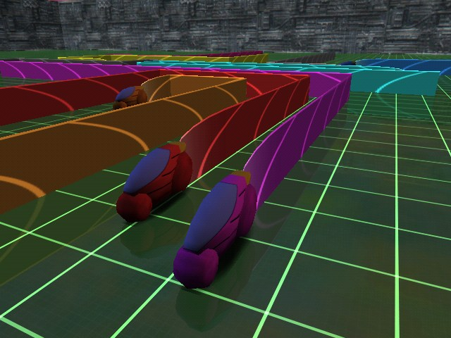
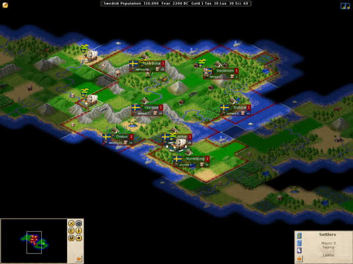
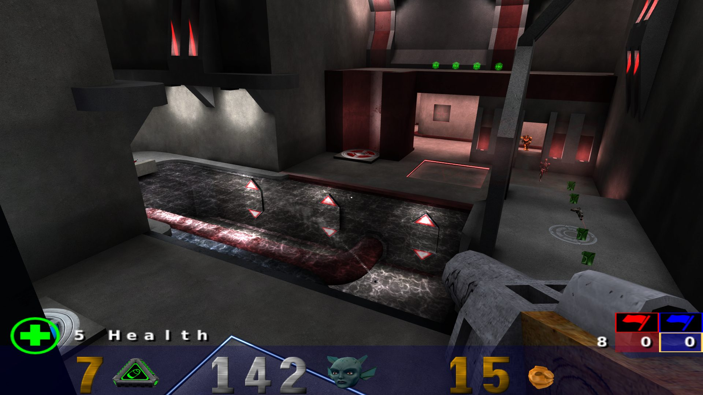

% Jeux vidéos libres

---
lang: fr
geometry: margin=1.25in
urlcolor: blue
...

# 0 A.D.
## Stratégie temp réel

{width="180"}

Jeu vidéo de stratégie en temps réel développé et édité par Wildfire Games pour Windows, GNU/Linux et Mac OS.

Pour donner un second souffle au développement du jeu, celui-ci a été libéré intégralement sous licence libre, moteur et données artistiques inclues.

[play0ad.com](https://play0ad.com/)

# Armagetron Advanced
## Course

{width="180"}

Inspiré du film TRON, vous êtes aux commandes d'un lightcycle, sorte de moto qui laisse un mur derrirèe elle en avançant, dans une l'arène de jeu. Le but est de pousser les adversaires à se heurter aux murs ou aux parois. 

[armagetronad.org](https://www.armagetronad.org/)

# Battle for Wesnoth
## Stratégie tour par tour

{width="180"}

Jeu vidéo de stratégie au tour par tour dans un univers médiéval fantastique.

En mode solo plusieurs campagnes racontent l'histoire du royaume de Wesnoth. Un grand nombre de campagnes sont mises librement à disposition pour la communauté. Le jeu a aussi un mode multijoueur via internet ou en local.

[wesnoth.org](https://www.wesnoth.org/)

# Freeciv
## Stratégie au tour par tour

{width="180"}

Jeu dans lequel chacun des joueurs devient le chef d'une civilisation, luttant pour parvenir au but ultime : devenir la plus grande civilisation du monde.

Comparable à Civilization, le jeu consiste à fonder une première ville, puis, à partir d'elle, à développer une civilisation qui dépasse toutes ses concurrentes.

[freeciv.org](http://www.freeciv.org/)

# Frets on Fire
## Simulation

{width="180"}

Jeu de simulation de guitare pour améliorer sa dextérité au clavier tout en s'amusant.

[fretsonfire.sourceforge.net](http://fretsonfire.sourceforge.net/)

# GCompris
## Educatif

{width="180"}

Logiciel éducatif qui propose des activités variées aux enfants de 2 à 10 ans.

[gcompris.net](http://gcompris.net/)

# Hedgewars
## Action

{width="180"}

Clone de Worms, jeu de stratégie au tour par tour en 2D dans lequel plusieurs équipes de hérissons s'entretuent.

[hedgewars.org](http://www.hedgewars.org/)

# Kobo Deluxe
## Shoot them up

{width="180"}

L'objectif est de détruire toutes les structures à chaque niveau en tirant sur l'ampoule pourpre au centre de la structure. Naturellement, les divers ennemis essayent de vous descendre en même temps. Ce jeu provoque une étrange dépendance. 

[olofson.net/kobodl](http://olofson.net/kobodl/)

# Minetest
## Inclassable

{width="180"}

Jeu de type «bac à sable» où vous réaménagez un terrain constitué de blocs cubiques aux graphismes pixel-art. L'installation est simple et le jeu est entièrement traduit en français.

C'est aussi un serveur qui permet d'accueillir vos amis ou simplement quelques visiteurs curieux voire même des joueurs chevronnés.

[minetest.net](https://www.minetest.net/)

# OpenArena
## Jeu de tir à la première personne (FPS)

{width="180"}

OpenArena est un Doom-like multi-joueur en ligne basé sur le moteur open-source de Quake 3. 

Le gameplay est trés proche de Quake III, le but étant de proposer une version complètement libre de jeu d'origine, tout en étant compatible avec ses modules de jeu (mod).

[openarena.ws](http://openarena.ws/)

# Red eclipse
## Jeu de tir à la première personne (FPS)

{width="180"}

Jeu FPS offrant un système de parcours innovant et au rythme haletant !

Le code est sous licence Zlib et les données sous CC-BY-SA, le jeu est donc entièrement libre.

[redeclipse.net](https://redeclipse.net/)

# SuperTuxKart
## Jeu de course

{width="180"}

Bien qu'étant un clone de Mario Kart, le jeu innove, par exemple avec un mode de jeu Suivre le meneur. En constant développement, il dispose d'une communauté active et reçoit de la part des médias du web des critiques plutôt positives.

Ces karts et ces circuits ainsi que ceux disponibles par défaut sont réalisés sous le logiciel libre de modélisation et de rendu 3D Blender.

[supertuxkart.net](https://supertuxkart.net/)

# Teeworlds
## Action

{width="180"}

Teeworlds est un jeu multijoueur d'action/arcade en 2 dimensions assez rapide. 

Le joueur y incarne une petite créature ronde, le tee, qui utilise un grappin pour se déplacer. 
À l'aide de différentes armes, en équipe ou seul, pour voler le drapeau à ses adversaires, ou tous les tuer, selon le mode de jeu.

[teeworlds.com](https://teeworlds.com/)

# Crédits et ressources

Source des notices :

* l'annuaire des jeux libres [jeuxlibres.net](http://jeuxlibres.net/)
* La section jeux de l'annuaire des logiciels libres [framalibre.org](https://framalibre.org/annuaires/jeux)

[^framalibre]: Source: [framalibre.org](https://framalibre.org/annuaires/jeux)
[^jeuxlibres]: Source: [jeuxlibres.net](http://jeuxlibres.net/)
